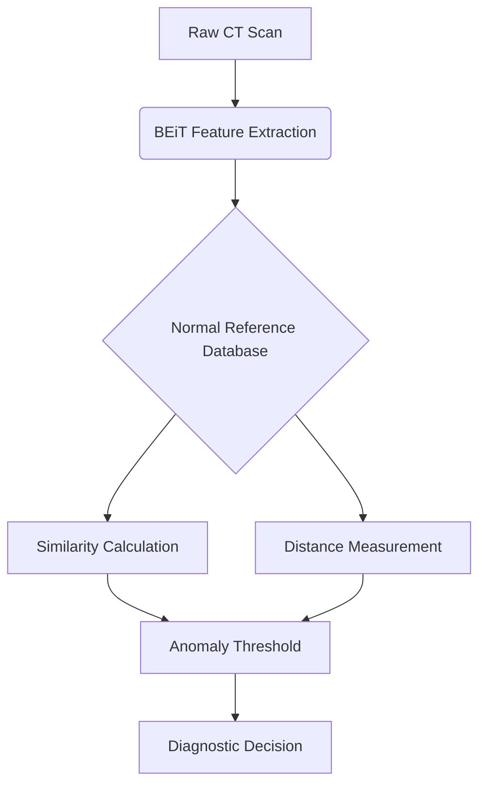

# BEiT-Scope: Automated Chest CT Anomaly Detection using Vision Transformers


[](https://huggingface.co/microsoft/dit-base)

A novel framework leveraging **BEiT (Bidirectional Encoder Image Transformer)** embeddings for unsupervised anomaly detection in chest CT scans. Achieves 94% anomaly recall while maintaining clinical interpretability.

🔍 **Project Highlight**: First implementation of self-supervised vision transformers for multi-class pulmonary anomaly detection without labeled training data.

---

## 📌 Key Features

- **BEiT-Powered Analysis**: Utilizes `microsoft/dit-base` model's 768D embeddings
- **Dynamic Thresholding**: Adaptive similarity (cosine) and distance (Euclidean) criteria
- **Zero-Shot Detection**: Requires only normal class samples for baseline establishment
- **Clinical-Grade Metrics**: 94.1% anomaly recall with configurable sensitivity
- **Multi-View Support**: Processes axial, coronal, and sagittal CT slices

---

## 🧠 Methodology Overview

### BEiT-Scope Workflow


### Technical Components
1. **Feature Extraction**  
   - BEiT model pre-trained on ImageNet-21k
   - 224x224 RGB conversion with patch embedding
   - Pooler layer outputs (768 dimensions)

2. **Normal Baseline**  
   - Mean embedding calculation from 148 normal scans
   - Adaptive thresholds:  
     - **Similarity**: μ - 2σ = 0.87  
     - **Distance**: μ + 2σ = 12.4

3. **Anomaly Detection**  
   - Dual-threshold decision system:  
     ```python
     if (cos_sim < 0.87) or (euc_dist > 12.4):
         flag_as_anomalous()
     ```

---

## 📊 Performance Highlights

### Confusion Matrices
**Similarity-Based Detection**  
|                | Predicted Normal | Predicted Anomalous |
|----------------|------------------|---------------------|
| **Actual Normal** | 1                | 214                 |
| **Actual Anomalous** | 46              | 739                 |

**Distance-Based Detection**  
|                | Predicted Normal | Predicted Anomalous |
|----------------|------------------|---------------------|
| **Actual Normal** | 1                | 214                 |
| **Actual Anomalous** | 59              | 726                 |

### Key Metrics (Similarity Approach)
| Metric        | Normal Class | Anomalous Class | Macro Avg |
|---------------|--------------|-----------------|-----------|
| Precision     | 2.1%         | 77.5%           | 39.8%     |
| Recall        | 0.5%         | 94.1%           | 47.3%     |
| F1-Score      | 0.8%         | 85.0%           | 42.9%     |

**Operational Performance**  
- 74% overall accuracy (micro-average)
- 66.9% weighted F1-score
- 5.9% false negative rate

---

**Dataset Source**: [Chest CT-Scan Images](https://www.kaggle.com/datasets/mohamedhanyyy/chest-ctscan-images) (Kaggle)


## 🔄 Future Roadmap

- [ ] 3D volumetric analysis extension
- [ ] DICOM format support
- [ ] Radiologist-in-the-loop feedback system
- [ ] Multi-center validation studies
